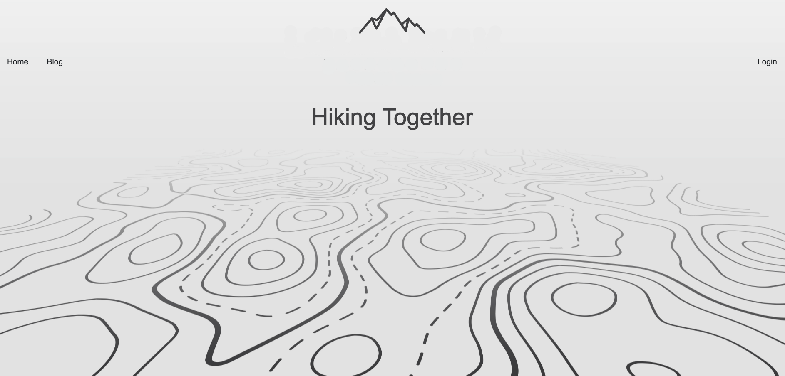

# hiking_blog

[](https://opensource.org/licenses/MIT)

## Live Link

https://frozen-chamber-96250.herokuapp.com/

## Description

AS A developer who also like hiking, I want built a CMS-style hiking blog site. So that I can publish articles, blog posts, and my thoughts and opinions, share good place can go to hiking in Colorado or Taiwan.

## Table of Contents

- [Description](#description)
- [Installation](#installation)
- [Usage](#usage)
- [Built_With](#built-with)
- [API_Resources](#api-resources)
- [License](#license)

## Installation

```
 git clone https://github.com/ollyhite/hiking_blog.git
```

- create a file
- open ternimal and cd the file name you created
- git clone with my repo link (can copy Installation section's first line)
- cd in the hiking_blog file
- enter "npm i" to install the node_module
- add your mysql user name and password in .env file
- go to db file to run mysql

```
    mysql -u root -p
```

- run source to create the table

```
    source schema.sql;
```

- run source to insert the data (or you can insert data in mysql branch or Ace)

```
    npm run seed
```

- enter "npm start" to run the project and can see my hiking blog website.

## Usage

 \

## Built With

- Handlebars
- Javascript
- Node.js

## API Resources

- npmjs-express
- npmjs-sequelize
- npmjs-mysql2
- npmjs-dotenv
- npmjs-express-handlebars
- npmjs-express-session
- npmjs-handlebars

## Author Info & Getting Help

- [Pei-Yun Hite's Github Link](https://github.com/ollyhite)
- Send Qquestions or suggestions for changes to the readme_generator_tool project maintainer, [Pei-Yun Hite](mailto:ollyhite8520@gmail.com?subject=[GitHub]%20employee_organizer%20) , for consideration.

## Credits

Data Source: https://www.alltrails.com/

## License

MIT License
Copyright (c) 2022 Pei-Yun Hite
Permission is hereby granted, free of charge, to any person obtaining a copy of this software and associated documentation files (the "Software"), to deal in the Software without restriction, including without limitation the rights to use, copy, modify, merge, publish, distribute, sublicense, and/or sell copies of the Software, and to permit persons to whom the Software is furnished to do so, subject to the following conditions:
The above copyright notice and this permission notice shall be included in all copies or substantial portions of the Software.
THE SOFTWARE IS PROVIDED "AS IS", WITHOUT WARRANTY OF ANY KIND, EXPRESS OR IMPLIED, INCLUDING BUT NOT LIMITED TO THE WARRANTIES OF MERCHANTABILITY, FITNESS FOR A PARTICULAR PURPOSE AND NONINFRINGEMENT. IN NO EVENT SHALL THE AUTHORS OR COPYRIGHT HOLDERS BE LIABLE FOR ANY CLAIM, DAMAGES OR OTHER LIABILITY, WHETHER IN AN ACTION OF CONTRACT, TORT OR OTHERWISE, ARISING FROM, OUT OF OR IN CONNECTION WITH THE SOFTWARE OR THE USE OR OTHER DEALINGS IN THE SOFTWARE.

[https://choosealicense.com/licenses/mit/](https://choosealicense.com/licenses/mit/)
